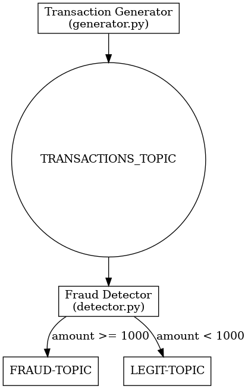

# Kafka-Fraud-Detection — Real-Time Fraud Detection Using Kafka Streaming
---
## Objective

This mini-project demonstrates a real-time fraud detection system using **Apache Kafka**. It simulates transaction data using the `Faker` library and classifies transactions as **fraudulent** or **legit** based on a simple threshold.

###  Fraud Criteria

A transaction is flagged as **fraudulent** if:
- `amount >= 1000`

---

##  Project Structure
```text
├── generator.py         # Kafka Producer generating random transaction data
├── detector.py          # Kafka Consumer & Producer detecting fraud and routing results
├── requirements.txt
└── README.md
```

---

##  Workflow

1. **Transaction Generator (`generator.py`)**: Sends synthetic transaction data to Kafka topic `TRANSACTIONS_TOPIC`.
2. **Fraud Detector (`detector.py`)**:
    - Listens to `TRANSACTIONS_TOPIC`
    - Flags fraudulent vs legit transactions
    - Sends fraudulent transactions to `FRAUD-TOPIC`
    - Sends legit transactions to `LEGIT-TOPIC`

###  Flowchart


```mermaid
flowchart LR
    A[Transaction Generator - generator.py)] --> B((TRANSACTIONS_TOPIC))
    B --> C[Fraud Detector - detector.py)]
    C -->|amount >= 1000| D[FRAUD-TOPIC]
    C -->|amount < 1000| E[LEGIT-TOPIC]
```

---

### `requirements.txt`

```txt
kafka-python==2.0.2
faker==24.9.0
```
---
### Steps To Run
```bash
pip install -r requirements.txt
```
```bash
python generator.py
```
```bash
python detector.py
```
--- 
### Sample Transaction JSON

```text
{
  "transaction_id": "b85c6adf-2121-46e9-a1b1-5e050c3a94aa",
  "date": "2025-06-13T03:15:09",
  "type": "withdrawal",
  "amount": 1524.57,
  "currency": "USD",
  "description": "streamline visionary convergence",
  "account_number": "DE89370400440532013000",
  "merchant": "ABC Corp",
  "category": "shopping",
  "balance_after": 4862.17
}
```
